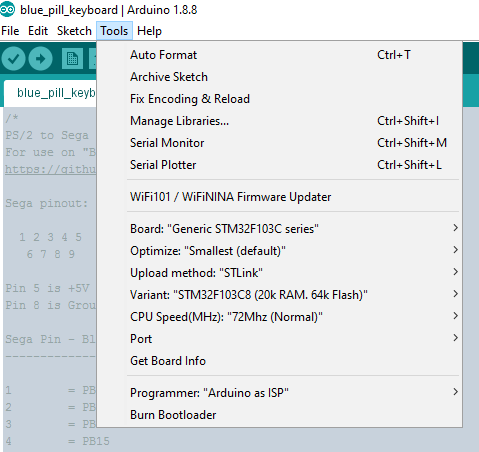

# Blue-Pill-Sega-Keyboard-Adapter
PS/2 to Sega XBAND keyboard adapter code. For use on "Bill Pill" STM32 board

The build folder contains the files generated by the Arduino IDE during compile and upload.

An STLink was used to program the Blue Pill.



blue_pill_keyboard.ino.bin in the build folder is the compiled binary.

Here is the console output from the Arduino IDE:

```
Sketch uses 16772 bytes (25%) of program storage space. Maximum is 65536 bytes.
Global variables use 3376 bytes (16%) of dynamic memory, leaving 17104 bytes for local variables. Maximum is 20480 bytes.
C:\Users\Turbo9000\Documents\Arduino\hardware\Arduino_STM32/tools/win/stlink_upload.bat COM7 {upload.altID} {upload.usbID} C:\Users\TURBO9~1\AppData\Local\Temp\arduino_build_805463/blue_pill_keyboard.ino.bin 
STM32 ST-LINK CLI v2.1.0
STM32 ST-LINK Command Line Interface

ST-LINK SN : 39FF6E063450373630170257
ST-LINK Firmware version : V2J29S7
Connected via SWD.
SWD Frequency = 1800K.
Connection mode : Normal.
Device ID:0x410 
Device flash Size : 64 Kbytes
Device family :STM32F10xx Medium-density

Loading file...
Flash Programming:
  File : C:\Users\TURBO9~1\AppData\Local\Temp\arduino_build_805463\blue_pill_keyboard.ino.bin
  Address : 0x08000000
Flash memory programming...
±±±±±±±±±±±±±±±±±±±±±±±±±±±±±±±±±±±±±±±±±±±±±±±±±± 0%
 0%€€€€€€€€€€€€€€€€€€€€€€ 45%€€€€€€€€€€€€€€€€€€€€€€€ 91%€€€€€ 100%
Flash memory programmed in 1s and 297ms.
Programming Complete.

MCU Reset.

Application started.
```
